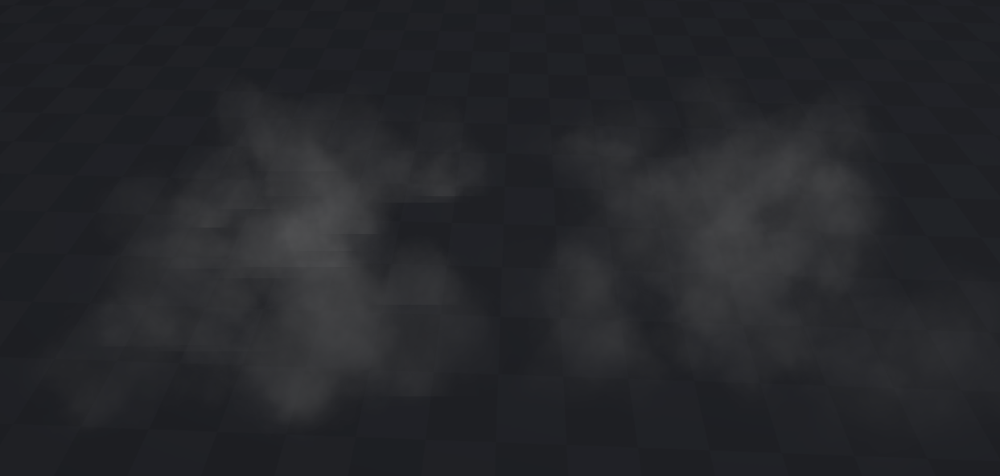
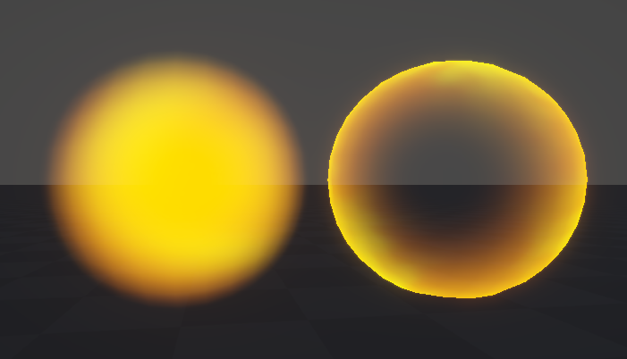
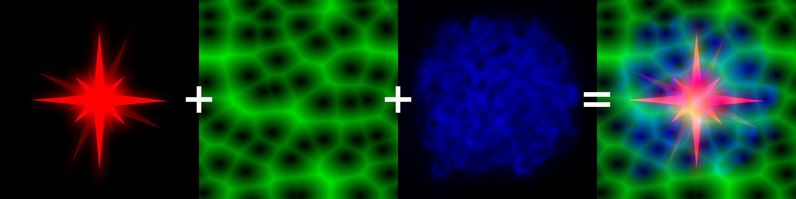

# VFX Shader
This repository contains a modular VFX shader for Unity’s **Universal Render Pipeline (URP)**, implemented in both **Shader Graph** and **HLSL**. The shader is designed for real-time visual effects and supports common VFX techniques such as distortion, dissolve, depth fade, and Fresnel effect, with integration into Unity’s Particle System via Custom Vertex Streams. The project is intended as both a practical tool and an educational reference for artists and developers working with VFX in Unity.

###### Developed in Unity  6000.0.51f1 | URP

## Installation
You can integrate this shader into your project in two ways:

#### Option 1: Unity Package (recommended)
1. Download the `VFX_Shader.unitypackage` from the [`/UnityPackage`](./UnityPackage) folder.
2. **Drag and drop** the package into your active Unity Project window.
3. Click **Import** in the pop-up dialog to confirm.

#### Option 2: Manual Asset Copy
1. Download the [`/Assets`](./Assets) folder from this repository.
2. Copy the contents directly into your project's `Assets/` directory.
3. Folder structure overview:
    * HLSL: Hand-written `VFXShader.shader` file and noise functions
    * Scripts: C# script for the custom Inspector GUI
    * ShaderGraph: Shader graph and its subgraphs

## How to Use
#### 1. Applying the Shader
Create a new Material and select the shader from the dropdown menu depending on which version you want to use:
* **Shader Graph version:** `Shader Graphs -> VFX_ShaderGraph` (or *CullOff* version).
* **HLSL version:** `Unlit -> VFXShader`.

#### 2. Mandatory Particle System Setup
> [!IMPORTANT]
>For the shader to function correctly you must configure the Particle System's vertex streams:

1. Select your Particle System in the Hierarchy.
2. Go to the `Renderer` module.
3. Check the `Custom Vertex Streams` checkbox *(this allows for vertex color to work correctly)*.
4. Click `'+' -> Lifetime -> AgePercent` to add a new stream *(this maps to the `uv.z` coordinate, allowing the shader to animate based on the particle's lifecycle)*.

## Features
The shader utilizes a custom graphical user interface `VFXShaderGUI.cs` that provides a unified experience for both the HLSL and Shader Graph versions. Designed to mimic Unity's Particle System inspector, the interface organizes settings into 6 modular sections that can be individually enabled or disabled via toggle switches. Users can click on any section header to expand and preview settings without necessarily activating the effect, while the expansion state and parameters are saved on a per-material basis to ensure a consistent workflow. The HLSL version includes an additional `Cull Mode` parameter for advanced geometry handling.

<b> MAIN SETTINGS</b>
 

---

This module includes the settings for:
 * **Main texture** and an option to change its wrap mode from **Repeat** to **Clamp**
 * **Gradient Mapping** of two custom HDR colors onto the grayscale values of the texture
 * **Intensity** setting for the entire texture to provide bloom or glow effect 
 * **Main texture scroll** on X and Y axis
 * **Main texture rotation** *(setting rotation speed to 360 will result in exactly one full clockwise rotation over the particle's entire life)*
 * Option to use particle's lifetime for all time-based animations implemented in the shader *(the value goes from 0 at birth to inputed value at death, otherwise the standard game clock is used for continuous scrolling)*
 
 For **Use Lifetime** to work correctly AgePercent in the Custom Vertex Streams must be enabled (see the Installation section).

<b>DISTORTION</b>
 

---

The Distortion module allows you to warp the UV coordinates of the Main Texture. It works by offsetting the texture sampling using various noise patterns or custom textures.

* You can choose between 4 different **Distortion Types**: 
     * **2D Texture** *(uses the green channel of distortion texture)*
     * **Gradient Noise**
     * **Simple Noise**
     * **Voronoi**
* **Distortion Amount**,
* **Distortion Scroll Speed** on X and Y axis
* **Distortion Rotation Speed**
* Parameters based on type selection:
     * **Scale** of the noise patterns
     * **Angle Offset** representing cell rotation of Voronoi

<b> MASK</b>
 

---

In the Mask module you can control the transparency, allowing for complex shapes beyond the basic quad or mesh geometry.

* **Mask Texture** where R channel values are converted to alpha (0 = transparent, 1 = opaque) and an option to set wrap mode to **Clamp**
* **Mask Scroll Speed** on X and Y axis
* **Mask Rotation Speed**
* Toggle **Use Mask Distortion** which gives you all the same options for distortion of mask texture, just like the ones listed in the previous section.

<b> DISSOLVE</b>
 

---

The Dissolve module creates a non-linear transparency effect where the texture gradually vanishes or appears based on grayscale thresholds. If **Dissolve Over Lifetime** is disabled it can work as a secondary mask.
* **Dissolve Texture** where B channel values determine the pattern of the dissolve
* **Dissolve Amount** Sets the base threshold for how much of the texture is dissolved
* **Edge Width** controls the softness of the dissolve edge *(a value of 0 results in a hard cut, while higher values create a smoother gradient at the transition boundary)*
* **Dissolve Speed** controls the rate at which the dissolve transition occurs *(only works as intended if Dissolve Over Lifetime is enabled)*
* if **Dissolve Over Lifetime** is enabled it dissolves the main texture based on the particle's age
* **Invert Dissolve** flips the logic for the effect to appear rather than disappear

<b> DEPTH FADE</b>
 

---

The Depth Fade module prevents harsh clipping lines where a particle intersects with 3D geometry.

* **Depth Fade Amount** controls the softness of the transition where particle intersects with other objects in the scene. Higher values result in a more gradual fade, allowing the effect to blend seamlessly with the environment.

###### Example of using (right) and not using (left) depth fade

<b> FRESNEL</b>
 

---

The Fresnel module calculates transparency based on the surface normal's orientation relative to the camera's view direction. It can be used to create soft edges or ghostly, hollow appearances.

* **Fresnel Power** controls the falloff of the effect. Higher values result in a tighter glow confined to the extreme edges of the mesh.

* **Edge 1 and Edge 2** set the lower and upper bounds of the smoothstep function to fine-tune the contrast and softness of the rim.
* **Invert Fresnel** flips the effect logic:
     * Disabled: fades out the edges to help the object blend naturally into the environment
     * Enabled: accents the edges while making the center transparent

---

### Texture Channel Packing
The shader is designed to use **Channel Packing** to reduce the number of texture assets in your project. Each module is hard-coded to sample a specific channel:
* **Red:** Mask 
* **Green:** Distortion 
* **Blue:** Dissolve 

> [!NOTE]
> While this approach reduces the total number of texture assets, the current implementation is not optimized for texture sampling.
